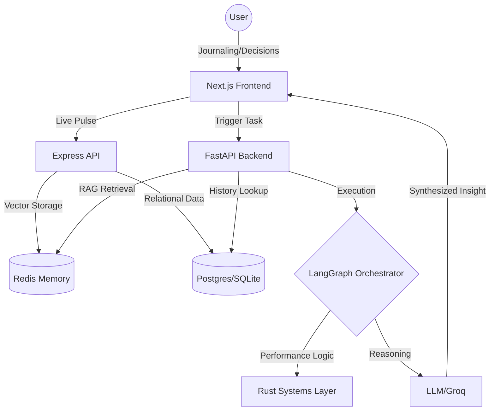

# Insight into Axiom: The Technical Sensemaking Engine

## 🌐 What is Axiom Signal?
Axiom Signal is an **Intelligence Layer** designed for high-velocity technical decision-makers. It transforms the fragmented process of research, journaling, and decision-making into a structured, searchable, and AI-synthesized technical asset. 

Axiom doesn't just store notes; it **decodes the narrative arc** of your engineering journey, identifying patterns, strategic contradictions, and visionary milestones that human developers often miss in the heat of delivery.

---

## 🏛️ The Multi-Layered Architecture
Axiom is built on a "Hybrid Intelligence" stack, combining the agility of modern web frameworks with the performance of systems-level programming.

### 1. The Core Infrastructure (MERN + Systems)
*   **Frontend (Next.js/React)**: A minimal, high-aesthetic interface focused on "Thought Capture" and "Live RAG Visualization."
*   **API Layer (Node.js/Express)**: Orchestrates real-time interactions and provides a stable interface for the frontend.
*   **High-Performance Backend (FastAPI/Python)**: Houses the LangGraph logic, the notification engine, and the RAG (Retrieval-Augmented Generation) pipeline.
*   **Systems Layer (Rust/Tokyo)**: Utilized for performance-critical data processing and high-concurrency design transformations.

### 2. The Memory System (Dual-Core Storage)
Axiom utilizes a proprietary dual-core memory strategy to ensure both speed and "infinite" context:
*   **Vector Memory (Redis)**: Stores embeddings of every thought, decision, and entry for semantic "fuzzy" lookups.
*   **Structured History (Postgres/SQLite)**: Traces hard facts—verdicts, confidence scores, and dates—allowing for deterministic pattern analysis.

---

## ⚙️ How it Works: The Methodology
Axiom operates using a concept we call **"Journey Merging."**

### Architectural Flow

### Step 1: Real-Time Capture
As you journal or record decisions, Axiom immediately vectorizes the data. It doesn't wait for "Save" to start thinking; it performs 1000ms "Pulse Checks" on your unsaved typing.

### Step 2: Context Synthesis
When an intelligence task (like `Analyze` or `Pitch`) is triggered, the system merges your **Live Unsaved Thought** with your **Historical Journey**. This creates a "complete technical context" that is strictly grounded in your actual work.

---

## 🏎️ Cross-Topic Intelligence: How Axiom Reacts
The power of Axiom is its ability to adapt its "Expert Voice" to whatever domain you are currently exploring.

### 1. The Frontend Architect (React/Design)
*   **Request**: "Analyze my Figma to React workflow."
*   **Axiom Reaction**: Focuses on **Component Reusability**, **Design System Integrity**, and **UI/UX bottlenecks**. It might suggest a transition from prop-drilling to Atomic Design based on your historical friction.

### 2. The Systems Engineer (Rust/C++)
*   **Request**: "Audit my Tokyo task management."
*   **Axiom Reaction**: Highly technical. Focuses on **Memory Safety**, **Concurrency Patterns**, and **Resource Contention**. It identifies if you are "looping" on borrow-checker errors and suggests specific architectural pivots.

### 3. The DevOps Strategist (Docker/K8s)
*   **Request**: "Summarize my deployment evolution."
*   **Axiom Reaction**: Focuses on **Pipeline Reliability**, **Scaling Trade-offs**, and **Infrastructure Depth**. It traces your journey from manual scripts to containerization, highlighting the complexity-to-value ratio.

---

## 🏆 Case Study: Executive Technical Synthesis
Below is an example of the high-signal output Axiom generates for a judge or stakeholder. This report was synthesized from 20+ journal entries regarding a transition from MERN to Rust/Tokyo.

### [EXAMPLE] Executive Technical Synthesis: Axiom Signal Engine
> **The Vision**: To transform raw technical struggle into a strategic asset. Tracing the narrative arc from Figma pattern analysis to complex Rust systems integration.
>
> **Technical Architecture**: Exploring a MERN + Rust hybrid foundation. MongoDB for flexibility, Node.js for APIs, and Rust/Tokyo for performance-critical design transformations.
>
> **Technical Milestones**: 
> *   Narrative transition from backend exploration to high-performance systems.
> *   Bridging Computer Vision (CNN) with Figma API for closed-loop automation.
>
> **Axiom Pulse**: **High Impact Score (90%)** | Strategic commitment to the Rust-based performance architecture.

Axiom Signal isn't just a tool; it's a **Technical Copilot** that ensures your architecture remains as visionary as your ambitions.
